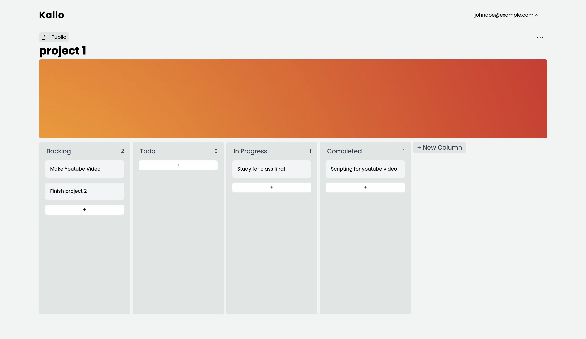

# 👋🏽 Welcome to Kallo



Kallo is an kanban based task manager application that allows you to organize any projects or tasks into boards and todo lists. It's a customizable kanban board application that can be used for your projects, agile development, and tracking your progress.

## Tech Stack

- TypeScript
- Next.js
- Supabase
- TailwindCss
- Unsplash Api
- React Beautiful D&D


## Get Unsplash API Keys
```sh
open https://unsplash.com/developers
```
Head over to the [Unsplash Api website](https://unsplash.com/developers) and create an account and register as a developer ~ it's free.
After signup head over to `your apps` located on the header / navbar and create a new app. Read and accept the terms of agreement. Enter your project details and once you've created the app scroll all the way down to keys and copy and paste your `secret and access keys`. Your Unsplash Api keys will be used be stored in the .env.local file inside the client directory that we will make later.

## Features

- A beautifully designed kanban board focused on getting things done.
- You can create a project and include any picture using the Unsplash Api.
- Each project starts off with a kanban board which you can add your custom columns and cards to.
- Columns can be re-arranged to any order you like.
- Each card can be dragged and dropped into a column.
- Each card can have tags which can be set to specific colors.
- Each card is called a task and inside each task you can create your own todo list with subtasks.
- <s>Dark and Light Theme Mode.</s>

## Installation to run in your local environment

Be sure to have Node.js and Postgresql / psql terminal installed before continuing. ~ The project has recently migrated to typescript so you can also run:

```
npm i -g typescript
```

Clone the project

```sh
  git clone https://github.com/lorenzejay/kallo.git
```

Go to the project directory

```sh
  cd kallo
```

## Start Node Server (Backend)

Install dependencies - You will need to also do this in the client directory

```sh
  npm install
```

Create a .env file

```sh
  touch .env.local
```

Open up psql terminal, login with your credentials that you made during installation and create a new database for this project.

```
CREATE DATABASE kallo
```

Go into your database you created

```sh
\c kallo
```

Go over to database.sql file in the root directory and copy and paste the remaining code over on the psql terminal to setup the database.
This first one is important as the project is using uuid's for the primary keys and when using postgreSQL, we must install it first.

```
CREATE EXTENSION IF NOT EXISTS "uuid-ossp";
...
...
...
```

Inside your .env in the root directory (there is also one for client but we will get to that later) file include:

```env
NODE_ENV = Development
NEXT_PUBLIC_UNSPLASH_ACCESS_KEY = your_access_key_here
UNPLASH_SECRET_KEY = your_secret_key_here
NEXT_PUBLIC_SUPABASE_URL= your_key
NEXT_PUBLIC_SUPABASE_ANON_KEY=anon_key
```

Start the server - server will run on port 3000

```sh
  npm run dev
```
open port 3000
```sh
open localhost:3000
```

### Roadmap

- [x] Convert to use Supabase
- [x] Tags
- [ ] Double Click Hook
- [ ] Dark / Light / Customizable Themes
